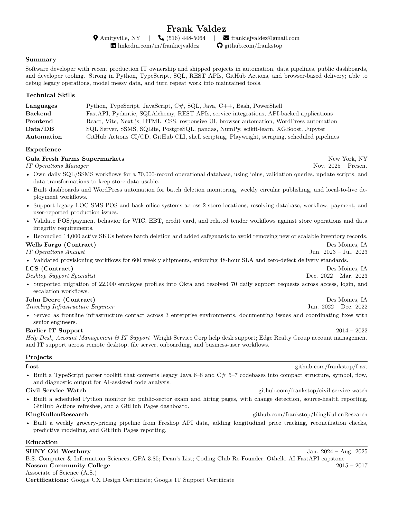

# Frank Valdez Resume

This repo publishes a PNG preview of my current resume on GitHub Pages, with PDF download and LaTeX source links close by. Serious document, suspicious amount of machinery.

## Badge Central

## What This Resume Says

I build tools that make messy work less cursed: SQL checks, data cleanup, GitHub Actions jobs, public dashboards, parser tools, scraping pipelines, and browser-based delivery. I have also spent enough time around POS systems, identity migration, desktop support, and infrastructure issues to respect boring production work.

Current signal: software developer with hands-on IT operations background. Not a vibes-only resume. Also not pretending a PNG is a PDF. Page displays PNG, button gives PDF, link gives TeX.

## Resume Links

[Open PDF](FrankValdezResumeJune_IconSpaced.pdf)  
[Read LaTeX source](FrankValdezResumeJune_IconSpaced.tex)
